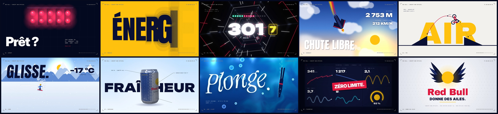

# Red Bull — Concept ’26 (spec, non officiel)

> **Concept non officiel.** Exercice de motion design (« spec ad ») réalisé pour un portfolio.
> Il n'est ni affilié à Red Bull, ni approuvé ou commandé par la marque. Le logo officiel
> (les taureaux) n'est pas reproduit : la marque est seulement évoquée par ses codes visuels
> (bleu et argent de la canette, soleil jaune, rouge, nom en typographie) et par son accroche.

15 secondes en 1920×1080 à 60 images/s, entièrement générées par code, sans After Effects,
sans footage et sans samples. Le rythme est de la **drum & bass à 160 BPM** : 40 temps font
exactement 15 s, soit 10 mesures, donc **une scène par mesure**, et chaque coupe tombe sur un temps.

**Vidéo :** [`media/redbull-concept.mp4`](media/redbull-concept.mp4)



| # | Temps | Scène | Effet de motion design |
|---|-------|-------|------------------------|
| 01 | 0:00 | Départ | Grille suisse. Les 5 feux rouges de F1 s'allument sur les croches, puis s'éteignent. Un soleil jaune envahit l'écran pour le drop |
| 02 | 0:01.5 | Énergie | Typo cinétique, un mot par temps : ÉNERGIE / VITESSE / ALTITUDE / ADRÉNALINE. Le dernier mot se transforme en lignes de vitesse |
| 03 | 0:03.0 | F1 | Tunnel en shader aux couleurs de vibreur, traînées lumineuses, compteur jusqu'à 342 km/h, passage de rapport à chaque temps avec voyants de volant |
| 04 | 0:04.5 | Wingsuit | Chute libre à travers trois couches de nuages en parallaxe. La fumée rouge et jaune reste dans l'air et l'altitude défile. Transition en whip-pan |
| 05 | 0:06.0 | FMX | Backflip en formes géométriques, trajectoire avec keyframes, squash à la réception. Recul sur une grille 5×5 de figures qui se retournent en neige |
| 06 | 0:07.5 | Snow | Montagnes en aplats et parallaxe, carving en S vers la caméra, gerbes de poudreuse, −18 °C |
| 07 | 0:09.0 | Fraîcheur | Canette en raymarching 3D avec étiquette peinte en canvas, condensation et givre. Un nuage de froid s'échappe sur le temps, puis la caméra plonge dans le bleu |
| 08 | 0:10.5 | Surf / Cliff | Le bleu de la canette devient l'océan : plongeon, bulles, rayons et caustiques, typo liquide. Un glitch déchire l'image |
| 09 | 0:12.0 | Télémétrie | Tableau de bord des 5 sports en direct, sticker « ZÉRO LIMITE. », puis montage glitch à la double-croche |
| 10 | 0:13.5 | Donne des ailes | Wipe de toutes les couleurs. Le soleil revient et se déploie en ailes, puis le nom et « DONNE DES AILES. » |

## Construction

- `src/scenes/*.js` contient une scène par mesure. Chaque scène est une fonction pure du temps,
  donc n'importe quelle image se calcule seule, ce qui permet le rendu en parallèle.
- `src/gl.js` contient trois shaders WebGL2 : le tunnel, la canette (SDF + texture + gouttes)
  et l'océan.
- `audio.py` génère la drum & bass avec NumPy/SciPy : kick et snare two-step, basse reese,
  stabs, moteurs F1 et deux-temps synthétisés, vent, ouverture de canette (pop, hiss, fizz),
  splash, side-chain, réverbération et mastering.
- `render.mjs` pilote Chromium sans interface via Playwright, avec plusieurs workers et un encodage ffmpeg.

## Rebuild

```bash
./make.sh                              # bande-son + 900 images + mp4 (≈ 15 min sur 4 cœurs)
node render.mjs stills 3.9 9.6 14.7    # aperçu d'images isolées dans build/stills
npx serve .                            # puis index.html pour un aperçu temps réel avec le son
```
