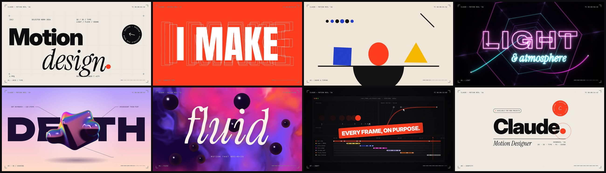

# Claude — Motion Reel ’26

A 15-second, 1920×1080, 60 fps motion design showreel built entirely in code: no
After Effects, no stock footage and no samples. Every pixel and every sound is
generated procedurally and locked to one musical grid. At 128 BPM, 32 beats last
exactly 15 s, so each scene is one bar long and every cut lands on a downbeat.

**Watch:** [`media/showreel.mp4`](media/showreel.mp4)



| # | Bar | Style | What it shows off |
|---|-----|-------|-------------------|
| 01 | 0:00 | Swiss grid / type | Grid build, masked type reveals, decode text, a red dot that becomes the period of "Motion design." and then swallows the frame |
| 02 | 0:01.9 | Kinetic type | One word per beat (I MAKE / THINGS / MOVE.), scale smears, outline echoes, marquee texture, squash & stretch landings |
| 03 | 0:03.8 | Bauhaus shape & timing | The period of MOVE. lands as a ball, and shapes build on the beat (overshoot, bounce, springs). The camera then pulls back to reveal a 5×5 system of variations |
| 04 | 0:05.6 | Neon light | Tile dots streak into a warp, a GLSL hex tunnel races past, a neon sign flickers on with bloom, then the scene collapses into a point of light |
| 05 | 0:07.5 | 3D | A raymarched SDF blob in iridescent chrome, sandwiched in front of the type, with technical callouts. The camera dives into its surface |
| 06 | 0:09.4 | Fluid | A domain-warped gradient with glossy metaballs and jelly type, until a glitch tears through it |
| 07 | 0:11.3 | Craft | A behind-the-scenes graph editor showing this reel's real timeline and easing curve, then a 16th-note glitch montage recapping every style |
| 08 | 0:13.1 | Identity | A colour-stack wipe of every palette in the reel, after which the dot from frame one writes the wordmark |

## How it's built

- `src/scenes/*.js` holds one scene per bar. Each is a pure function of time, so any frame
  renders in isolation (no simulation state), which makes parallel rendering possible.
- `src/gl.js` holds three WebGL2 fragment shaders (tunnel, chrome raymarcher, fluid),
  composited into Canvas 2D.
- `src/fx.js` holds the pixel-level glitch, bloom and film grain.
- `audio.py` is the soundtrack, synthesised with NumPy/SciPy: kick, clap, hats, supersaw pads,
  off-beat bass, arps with ping-pong delay, risers, impacts, neon buzz, UI clicks and FM bells.
  It is side-chained, reverbed and mastered. Each sound effect sits on the visual event it belongs to.
- `render.mjs` drives headless Chromium through Playwright. Frame chunks are pulled from a
  queue by parallel workers and encoded with ffmpeg.

## Build

```bash
./make.sh                 # soundtrack + 900 frames + final mp4 (≈12 min on 4 cores)
node render.mjs stills 2.0 8.4 13.9   # preview individual frames into build/stills
npx serve .               # then open index.html for a real-time preview with sound
```

Requires Node 18+, Playwright with Chromium, ffmpeg, and Python 3 with `numpy` and `scipy`.
